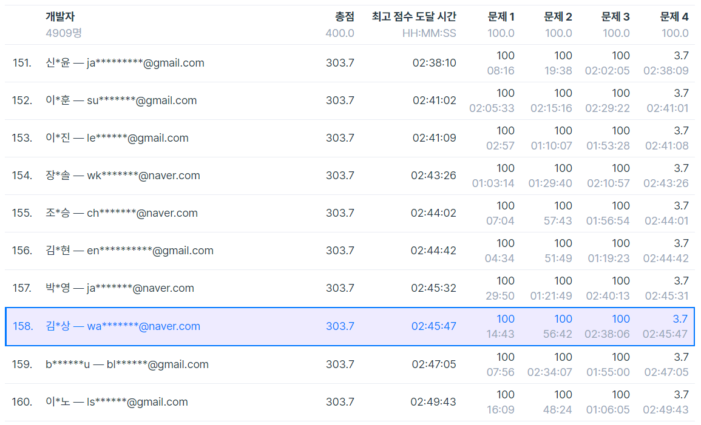

# 외부 라이브러리의 중요성

[11-Sep-2020 Fri]

## 오늘 한 일

- 아침(1시간): swexpertacademy 몸풀기로 몇문제 풀기
- 점심(2시간): 프로그래머스 후보키 풀어보기

## 오늘의 배운 점

후보키를 진짜 2시간동안 해매다가 도저히 안되서 집합과 itertools를 더 공부해야 겠다는 생각이 들었다.

확실히 외부 라이브러리의 편리함을 이용해서 문제를 풀면 효과적인데 나는 그렇지 못한 점이 아쉽다.

또 어려운 문제에 막히니 코딩이 재미없어졌다. 하루만에ㅋㅋㅋ 금요일이라 지금 끝내고

주말에는 카카오 코딩테스트를 보고 그 동안 못한 프로젝트들을 해야겠다.(갑작히 일기쓰는 느낌이네ㅋㅋㅋ)

## 다음에 할 일

카카오 코딩테스트, 프로젝트 준비, 못 푼 문제는 나중에 한 번 도전!

## 어제 한 일 요약

어제 코딩 테스트 등수 158등을 달성했다! [등수 보기 링크](https://programmers.co.kr/competitions/417/monthly-code-challenge-s1?utm_source=programmers&utm_medium=learn_competition417&utm_campaign=competition417)

