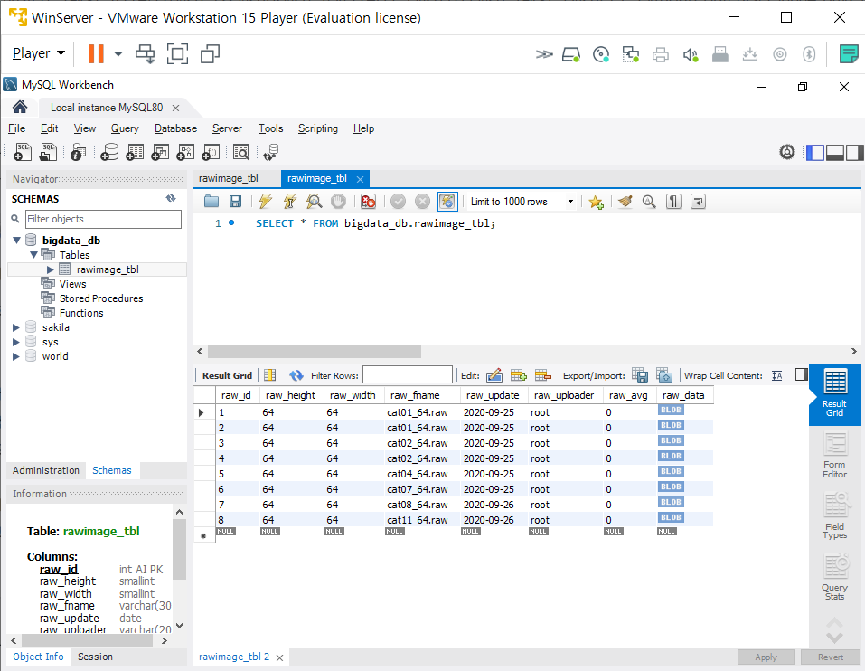

# [2.5급 비밀] 주식에 입문

[26-Sep-2020 Sat]

## Today I Learned Coding

Summary Python Project

## Today I Learned Everything

오늘은 일기를 쓰려고 합니다.

주식가치투자자 사촌형(김**)을 만나며 많은것을 배워서 공유하고 싶었습니다.

간단히 그의 이력을 소개하자면 S대 출신, ~~부자~~ 입니다.

우선 대화의 요약 입니다.

1. 주식 투자 기법에는 여러가지가 있습니다.
   1. POST(POST EARNING ANNOUNCEMENT DRIFT)
   2. QUANT(사건의 수(n)가 많을수록 유효합니다. 야구의 오클랜드같은 경우와 비슷)
2. 위에 두개는 빅데이터와 크롤링 등을 이용하여 주식투자를 할 수 있습니다.
3. 심지어 한 투자자는 **년간 수익률이 2\*\*n**으로 발생할 수 있다는 소리를 듣고 깜짝 놀랬습니다.
   - 2**n 이라면 10년이면 1024배 입니다. 아닌 경우도 있음
   - 이론상 **100만원**으로 **102억**을 찍을 수 있습니다. 그 투자자는 이미 보유 중 입니다.
4. 따라서 저의 인생 계획 중 하나인 FIRE를 쉽게 달성할 수 있습니다.
   > FIRE: Financial Independence and Retiring Early

그러면 이제 어떻게 시작하냐 입니다. 지금 시작할 수 있는 방법은 다음과 같습니다.

1. 일단 주식 계좌를 만듭니다.
2. 가치투자라는 개념을 배운다.
   - 책 추천1: 전설로 떠나는 월가의 영웅(피터린치, 존 로스차일드)
   - 책 추천2: 한국형 가치투자 전략(최준철, 김민국) 이론만 배울 것(실전x)
3. 증권 API를 가져오는 기술을 익힌다.

그러므로 저의 5년정도 (중장기)프로젝트 방향이 하나 생겼습니다.

같이 공부할 사람이나 더 궁금하다면 카카오톡으로 연락주세요.

## TO DO NEXT

리눅스 4장, 파이썬 프로젝트 진행하기

## Summary I Learned Yesterday

오늘 새벽에 실습한 코드 결과입니다. 파이썬 비주얼을 복습하였습니다.

예전에는 어려웠던 것이 이번에는 한결 쉬워진 기분이였습니다.

