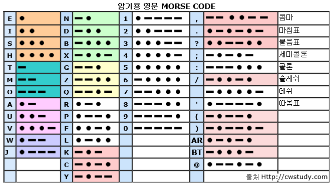
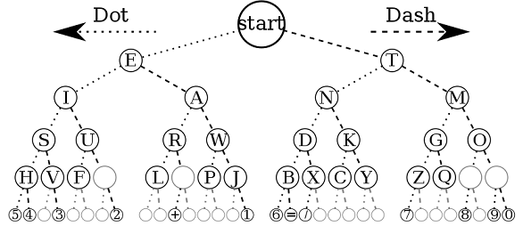

# Code: The Hidden Language of Computer Hardware and Software

- 2021-02-07

이 책을 멀티캠퍼스 출석왕으로 선물 받게되서 영광입니다.

컴퓨터 관련 책으로 추천을 받아 읽게 되었습니다.

## Summary

책의 목차를 스스로 요약해 봤습니다.

1. Chapter 01 정보의 전달, 모스 부호
2. Chapter 02 이진수, 정보의 양
3. Chapter 03 점자, 정보의 압축의 효율
4. Chapter 04 전기가 작동하는 원리
5. Chapter 05 전기를 이용한 정보의 전달과 교환
6. Chapter 06 통신의 시작, 전신의 발명
7. Chapter 07 10진수, 0과 기수법
8. Chapter 08 2진수

## Chapter1. 친한 친구와의 대화

10살짜리 꼬마는 옆 집 친구와 저녁에 대화하려고 합니다.

**손전등을 사용**해 손전등으로 글자를 쓰지만 어떤 글자를 적는지 모르는 한계가 있습니다.

더 좋은 방법으로 **스위치를 껏다켰다** 하면서 메시지를 보내려고 합니다. (A: 1, B: 2, C: 3 ...)

`How are you?`라는 단어는 131번의 손전등을 깜빡여야 합니다. 단어 사이에 term도 두어야 하죠.

더 좋은 방법은 **모스 부호**를 이용하는 것입니다. 더 *짧은 신호의 수로 짧은 시간으로 통신*을 할 수 있죠.



모스 부호는 **점(dot)**과 **선(dash)**으로 구성되어 있습니다.

단점은 받는 사람이 더 어렵다는 것입니다.

그 이유는 점과 선의 길이를 다르게 받을 수 있다는 점, 글자 사이의 간격, 글자 신호의 갯수 때문이죠.

중요한 점은 *두 가지 형태(2진수)로 통신*을 할 수 있습니다.

## Chapter2. 부호와 조합

모스 부호는 브리즈 모스(Breese Morse; 1791-1872)가 발명했습니다.

이전 장(2장)에서 말한 단점은 받는 사람이 더 어렵다는 이유 때문에 다른 표로 계산하면 쉽습니다.



신호의 갯수가 **1개**면 E 또는 T로 **2개** 입니다.

신호의 갯수가 **2개**면 I, A, N, M로 **4개** 입니다.

신호의 갯수가 **3개**면 S, U, R, W, D, K, G, O **8개** 입니다.

규칙

```text
표현할 수 있는 부호의 수 = 2^점과 선의 수
```

우리가 이진 부호를 분석하면서 했던 일들은 수학에서

**조합론(Combinatorics)** 또는 **조합적 분석(Combinatorial analysis)**이라 말하는 분야의 간단한 예입니다.

## Chapter3. 점자와 이진 부호

이 장의 앞부분은 점자 부호의 탄생에 대해 설명(필기 생략)했고 이제 어떻게 동작하는지 알아보려 합니다.

점자는 2열 3행짜리 볼록한 점으로 부호화가 되어 있습니다. 64가지의 정보를 나타낼 수 있죠.

알파벳은 26가지의 정보가 필요한데 충분히 가능하죠.

점자가 점점 발달하여 `2기 점자 체계(Grade 2 Braille)`이 탄생합니다.

**2기 점자 체계**는 좀 더 빨리 읽을 수 있도록 생략 어구들이 존재해 효과적입니다.

```text
자주 등장하는 2가지 글자(이중 모음, ch 등)를 1가지로 표현하고
숫자를 표시하기 위해 변환(Shift) 부호를 도입하고
대문자 표시 부호로 이스케이프(Escape) 부호를 부여했습니다.
```

대표적으로 `you and me`를 8글자를 4개의 점자로 표시할 수 있습니다.

## Chapter4. 전등을 분해해 봅시다

1장에서 설명한 손전등은 전기로 작동합니다. **전기**란 무엇일까요?

전기 자체는 이 세상 어떤 물질과도 다르기 때문에 자체의 용어들로 설명합니다.

**전기**란 전자론의 *전자의 움직임으로 인하여 발생*합니다.

세상의 모든 물질은 원자로 이루어져 있는데

모든 원자는 전자(electron), 양자(proton), 중성자(neutron)으로 구성됩니다.
