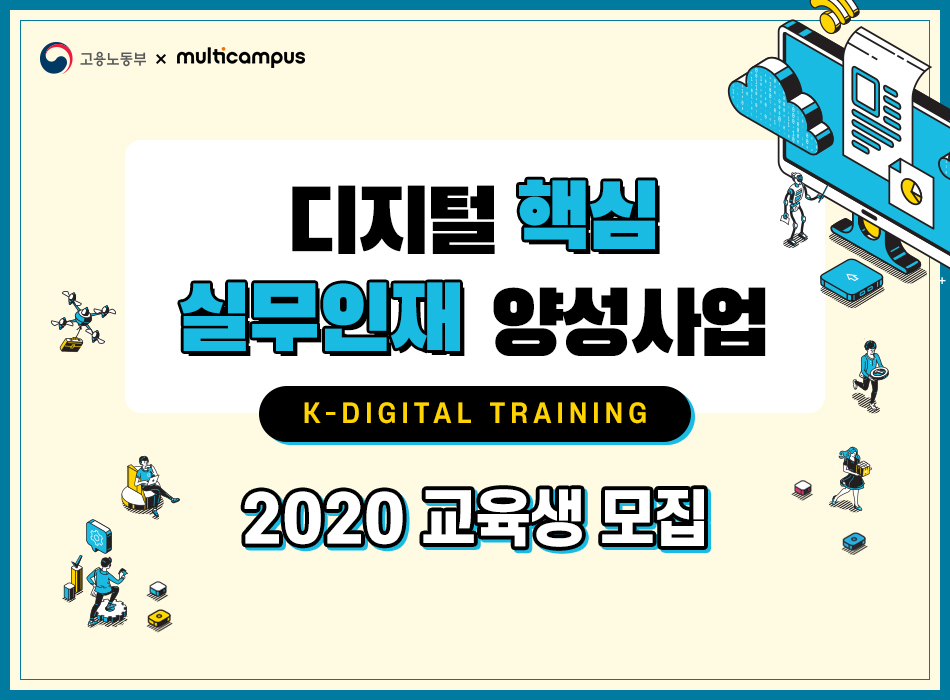
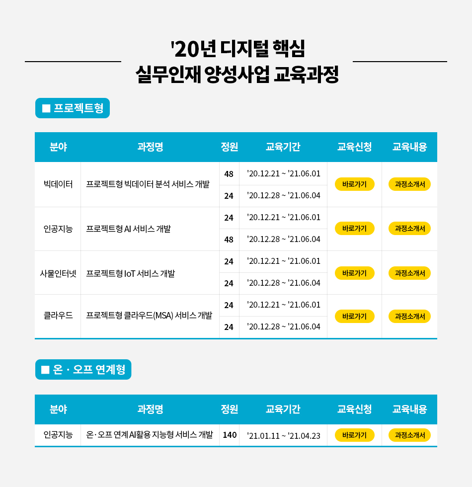
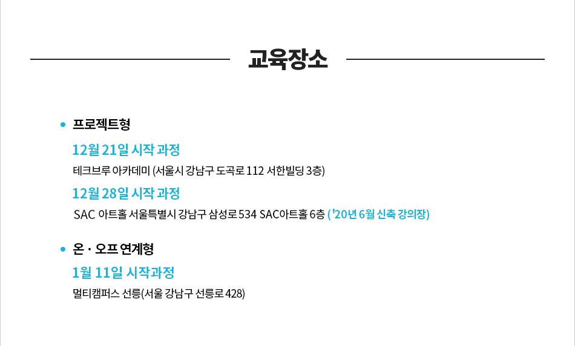

# 프로젝트형 클라우드(MSA) 서비스 개발

기간: 20.12.28 ~ 21.06.04

- 디지털 핵심 실무인재 양성교육 PPT [링크](https://www.multicampus.com/system/menu/iframe?p_url=aHR0cHM6Ly9lbC5tdWx0aWNhbXB1cy5jb20vZGVfY29tbW9uL2IyYy9ldmVudC8yMDIwLzEwLzEwMTNfMS8xMDEzXzEuaHRtbA==&htmlHghtPixelSize=6351&p_menu=MTE3I01BSU4=&p_gubun=Qw==&param2=106000000000000&param3=106001000000000)\(Link will be closed\)
- hrd-net 상세내용 자료 [링크](http://www.hrd.go.kr/hrdp/co/pcobo/PCOBO0100P.do?tracseId=AIG20200000286603&tracseTme=2&crseTracseSe=C0061&trainstCstmrId=500020039927#undefined)\(Link will be closed\)

### 디지털 핵심 실무인재 양성교육

- 멀티캠퍼스 상세내용 자료 [링크](http://el.multicampus.com/de_common/b2c/event/2020/10/1013_1/images/k_digital_project_cloud.pdf)\(Link will be closed\)

