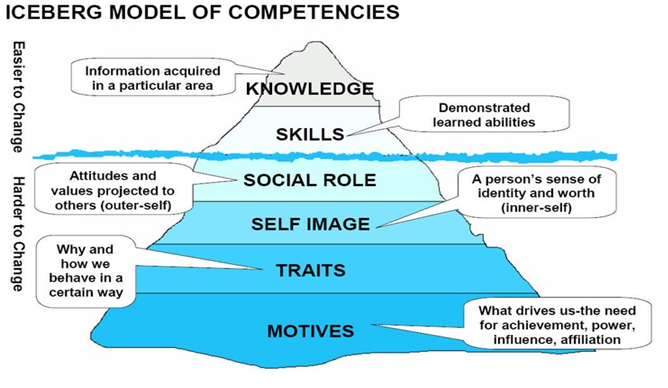
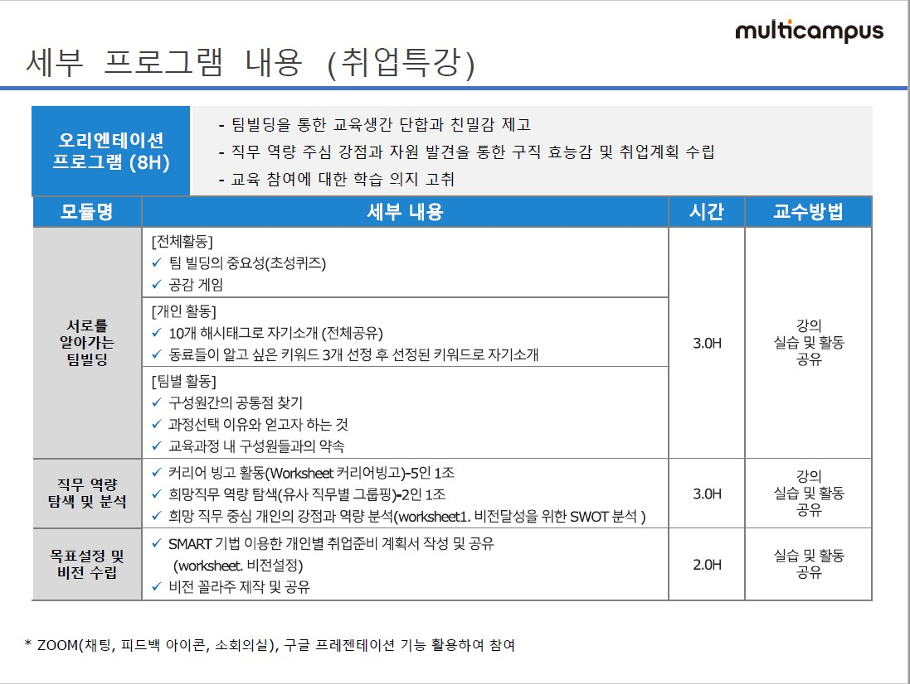

# 201228 취업 특강

## :one: 협업이란

나의 개발 모듈을 다른 사람들에게 충분히 설명해주는 것이 중요(인턴 경험에서)

## :two: 어떻게 공부할 것인가

나의 현재 상황을 알자

- 준비된 것: 해외 경험, 인턴, 졸업 작품, 영어 점수(TOEIC Speaking), 포트폴리오
- 하는 중: 코딩테스트, 알고리즘, 영어, Github, 빅데이터, Python, JavaScript, MySQL, Linux, Django
- 앞으로 할 것: 정보처리기사, 리눅스 마스터 1급

기업들이 요구하는 사항을 알아보자, 그것과 나의 공부하는 방향이 일치하는지 확인하기

## :three: 기업들의 채용 트랜드를 알아보자

기업이 중요시 하는 것: SPEC vs COMPETENCY

- `tangible`: perceptible by touch
- `intangible`: unable to be touched

빙산의 일각의 태도 부분을 강조하면 발전 가능성을 강조할 수 있어요.

아이티 면접 때 실수 -> 기술 뿐만 아니라, 팀빌딩 수행 태도를 물어보면 잘 대답하여야 합니다.

유명 IT 기업인 네이버, 카카오에 들어가서 그들이 원하는 것이 무엇인지 찾아봅니다.

CJ는 요구사항이 정말 잘 나와있습니다. CJ에서 한번 보세요. 방향성을 잡아 줄 것입니다.

삼성에서는 Zoom을 쓰다가 Webex를 쓰게 합니다.

다양한 것들을 쓰면서 그들만의 화상 연결 프로젝트를 구현하고 있습니다.

NCS 사이트에 들어가보기 링크 -> [https://www.ncs.go.kr/unity/th03/ncsSearchMain.do](https://www.ncs.go.kr/unity/th03/ncsSearchMain.do)

요구사항을 보고 공부를 하면 구체성과 시간을 줄일 수 있습니다.

## :four: 목표 설정하기

SMART 기법으로 목표를 설정하세요.

- SPECIFIC: 구체성을 세분화해라
- MEASURABLE: 기준을 설정하는 방법(수치로 표현하면 좋음)
- ACHIEVABLE: 달성 가능성을 객관적으로, 꿈만 같은 목표는 접기(연봉 100억)
- REALISTIC: 현실성
- TIMELY: 기간없는 목표는 힘듬

패들렛 메모 공유 웹 링크 -> [https://padlet.com/?ref=logo](https://padlet.com/?ref=logo)

Resilience Building: 4F(Facts, Feelings, Findings, Future)

## Feelings

Zoom 강의로 원격 강의로 들었습니다.
- 오프라인보다 소통이 안되서 아쉬웠습니다.
- 온라인 강의는 생각보다 피로도가 높은 것을 느꼈습니다.
- 마이크와 장비를 잘 써야 원활한 것 같습니다.
나의 목표가 너무 여기저기 있는 것 같습니다. 목표를 다시 설정해야 될 것 같습니다.

## Details

