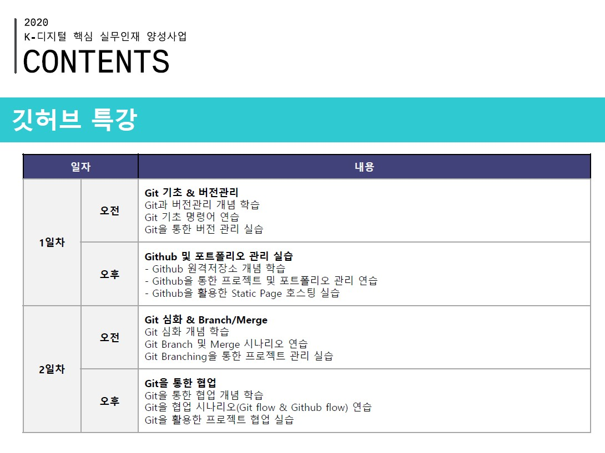

# 201229 Github Special Lecture

한 번 배운 수업이라 나만의 프로젝트(Farmming on git)를 진행했습니다.

## Industry 4.0

- Amazon warehouse KIVA robot, Dron Delivery, Speech recognition(Google Assistant), Amazon dash button(feat. Life Hacking)
- Recommending the similar picture when you draw a picture Link -> [https://www.autodraw.com/](https://www.autodraw.com/)
- Watson natural language, Using for 문맥으로 사람 분석 at 자소설 닷컴
  - 링크 -> [https://www.ibm.com/cloud/watson-natural-language-understanding](https://www.ibm.com/cloud/watson-natural-language-understanding)

> Don't reinvent the wheel

## 오픈소스와 Github & Gitbash

선생님 지인 Github 링크 -> [https://github.com/Gyubin](https://github.com/Gyubin)

Git is DVCS(Distributed Version Control System)

Git은 Google Email로 만드는 것을 추천합니다.(나는 naver mail...ㅜㅜ)

Gitbash Command
- `Ctrl` + `L`: Clear

`pyenv`: 파이썬 env 설명서를 다 github 사이트에 넣어놓음

## Github pages

github blog를 github 레파지토리를 이용할 수 있습니다. 링크 -> [https://pages.github.com/](https://pages.github.com/)

웹의 HTML + CSS + JS 로 구성되어 있는데 나중에 공부하시고 기본 웹 프레임워크를 제공해 주는 웹 페이지를 들어갑니다.

Start Bootstrap 링크 -> [https://startbootstrap.com/](https://startbootstrap.com/)

다양한 테마 중에 resume 다운 링크 -> [https://startbootstrap.com/theme/resume](https://startbootstrap.com/theme/resume)

사용자id.github.io 폴더를 생성한 뒤 다운 받았던 resume 파일들 복사 ex)wansang93.github.io

github 레파지토리에서 wansang93.github.io를 써서 만들고 연동시킵니다.

그리고 주소를 wansang93.github.io로 들어갑니다.

게시물을 jekyll 프레임 위크를 이용하면 마크다운 파일로만 게시글을 만들 수 있습니다.

`jekyll`을 이용하면 마크다운을 이쁘게 지원합니다.

`getsby`를 통해 블로그를 만들 수도 있습니다.

## DetailDon't reinvent the wheel

